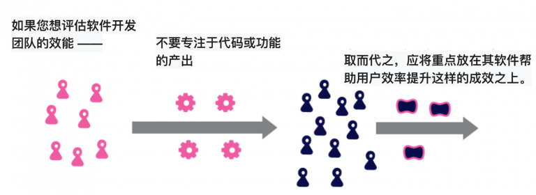

# 关注成效而非产出

假设有一个开发在线电商的团队，如果我们关注团队的产出，可能会考虑他们在上个季度中开发了多少新功能，或者考虑跨功能的提升，例如页面加载时间减少了多少。但是，如果考虑成效，增加销售收入或减少产品支持电话数量才是真正有价值的度量。关注成效而不是产出，就会更加倾向于构建那些可以提高软件用户和客户效率的功能。  

与任何专业活动一样，从事软件开发的我们也希望学习如何能够更加高效。这对于希望改善自身绩效的个体开发者，希望改善组织内团队的管理者，亦或是像我这样试图提高整个行业游戏水平的专业人士来说，都是如此。造成这方面学习困难的原因之一是没有明确的方法来衡量软件团队的生产力。在此之上，考虑基于产出还是成效评价有效性，让这个问题变得更加复杂。  

我一直认为成效是我们应该关注的重点。试想一个团队提供了很多功能（无论我们是用代码量、功能点、还是用户故事来度量），只要这些功能没有帮助用户改善生产活动，其实都是无用功。许多未使用的功能被浪费，更糟糕的是未使用的代码会使代码库膨胀，从而使将来添加新功能变得越来越困难。身处这样境地的软件开发团队需要关心新功能的实用性，减少新功能的开发，从而能够聚焦功能实用性。  

我听说过一个反对使用基于成效作为观察点的论点 —— 要想针对成效提出可重复的度量，要比针对产出难很多。我个人很难理解此观点：众所周知，度量软件开发的纯产出是困难的，即使不玩复杂的游戏，代码行也是无用的度量；功能点或故事点的可复制性更差，不同的开发者针对同一事项会做出不同的评估。与此相比，我们是非常擅长衡量财务结果的。当然，确实有很多成效的度量是比较棘手的，比如客户满意度，但我认为其中任何一个都不会比软件功能开发困难。  

仅将某事项称为“成效”并不能使其成为正确的关注点，并且选择正确的成效进行观察确实是一项技能。 [Seiden](https://www.amazon.com/gp/product/B07QJ1Y8Y5?ie=UTF8&tag=martinfowlerc-20&linkCode=as2&camp=1789&creative=9325&creativeASIN=B07QJ1Y8Y5)提出过一个简单判断，他说成效应该展现在对组织有利的用户、雇员或客户的行为变化之上。他进一步区分了“成效”和“影响”，前者是易于观察的行为变化，后者是对组织更广泛的效果。在开发EDGE框架时，[Highsmith，Luu和Robinson](https://www.amazon.com/gp/product/0135263077?ie=UTF8&tag=martinfowlerc-20&linkCode=as2&camp=1789&creative=9325&creativeASIN=0135263077)建议，针对客户价值（洗碗机可靠性）的成效度量要比关于业务价值（保修维修成本）的成效度量更为重要。  

使用成效作为度量的一个结果是指标分解到软件开发团队相对困难。假设有一个使用软件来帮助他们跟踪供应链中商品质量的客户团队，如果我们根据最终消费者的拒单数来度量，那么到底有多少是由于软件本身造成的呢？有多少是由于质量分析师制定的质量管理过程产生的呢？还有多少是由于另外一项旨在提高原料质量的举措而产生的呢？

指标分解的困难是比较不同软件团队效能的巨大障碍，比如希望判断使用Clojure是否有助于提高团队开发效率这样的场景。类似也有典型案例，开发人员可以很好地工作并提供出色且有价值的软件来跟踪质量，但是质量管理过程却拖了后腿。最后的结果是尽管开发人员有出色的贡献，但拒单率并没有下降，该改进举措被视为失败。  

但是，分解面临的挑战不应作为观察错误事项的理由。我们常说“度量什么，得到什么”，在这种情况下，更像是“尝试什么，得到什么”。如果你将成功的评估重点放在产出上，那么每个人都会考虑如何增加自己的产出，即使和最后的成功毫无关系。因此，即使很难确定团队的工作如何影响最终成功，促使大家思考成效，以及如何改善成效，比任何对比团队无真正实效产出的努力都值得。  

### 进一步阅读

[Seiden](https://www.amazon.com/gp/product/B07QJ1Y8Y5?ie=UTF8&tag=martinfowlerc-20&linkCode=as2&camp=1789&creative=9325&creativeASIN=B07QJ1Y8Y5)为成效的思考提供了一个不错的框架，该框架是从非营利组织的经验中提炼出的，这些非营利组织在评估其工作的影响力方面也面临非常棘手的挑战。

我的同事们将[EDGE](https://www.amazon.com/gp/product/0135263077?ie=UTF8&tag=martinfowlerc-20&linkCode=as2&camp=1789&creative=9325&creativeASIN=0135263077)设计为一种帮助企业在数字化时代生存的运营模式。注重成效是其哲学的核心部分。

专注于成效度量自然会驱动出以[成效导向](https://martinfowler.com/bliki/OutcomeOriented.html)的团队。

| 原文地址：https://martinfowler.com/bliki/OutcomeOverOutput.html  
| 作者：Martin Fowler  
| 来源：https://insights.thoughtworks.cn/outcome-over-output/  
| 译者：肖然  