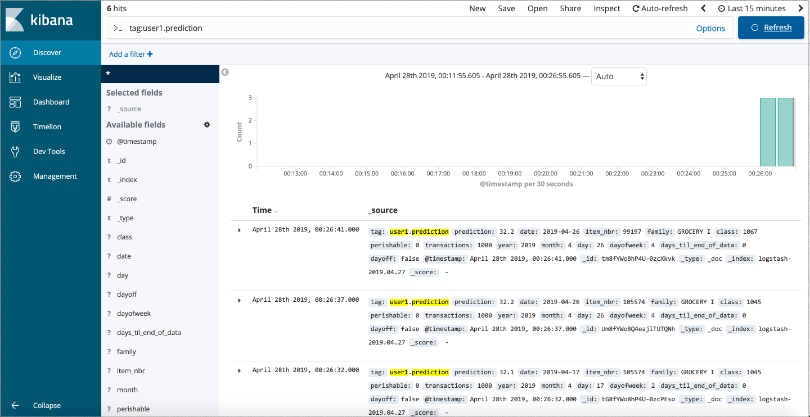
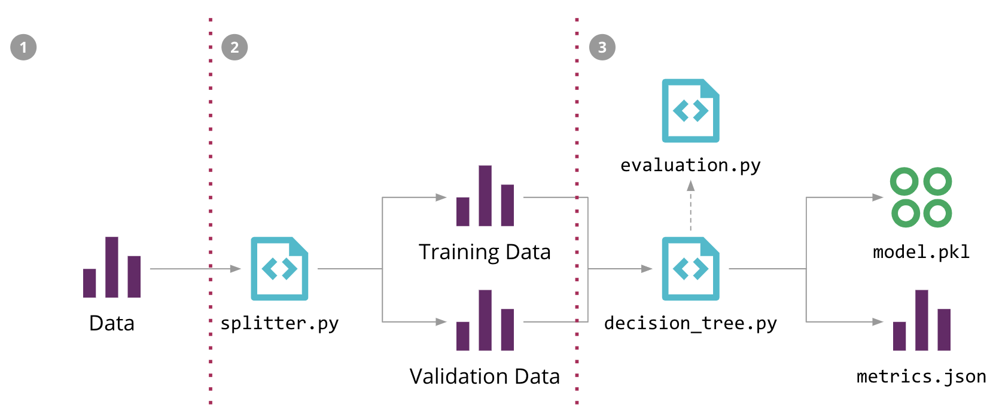

# 机器学习下的持续交付

*机器学习在行业中的应用变得越来越流行，然而相对于传统软件开发，例如Web服务或者Mobile应用来说，这类程序的开发、部署和持续改进也变得更加的复杂。它们的功能改变通常由以下三个维度驱动：代码本身的修改、模型的修改、数据的改变。这类程序的表现行为通常是非常复杂、难以预测、难以测试、不具备可解释性、很难去改进的。机器学习下的持续交付（CD4ML）是开发机器学习应用时可以遵循、参照的原则和最佳实践。*


### 前言简介

在 Google 2015年发出的著名论文[《机器学习系统中隐藏的技术债》](https://papers.nips.cc/paper/5656-hidden-technical-debt-in-machine-learning-systems.pdf)中，重点突出了在实际的机器学习系统中，机器学习的代码在系统中只占了很小的比重，周边有非常多的基础设施和流程来支持系统的演进，同时也提到了这种不断被积累下来的技术债的多种来源，其中有些技术债的来源与数据的依赖关系、模型的复杂度、可再现性、测试、监控和外部响应变化有着非常大的联系。

传统软件开发系统流程也存在许多人们同样关心的问题，而持续交付一直以来用自动化、高质量和规律性的方法，在生产环境中实践这种可靠且可复现的软件开发方式。在他们的创造性著作中，Jez Humble 和 David Farley 强调：

> “持续交付具有改变一切的可能性——包括新的特性，可控制的改变，各种BUG的修复以及实验项目——为了生产环境，或者说是为了用户，能够以一种可持续的软件开发方式快速安全的构建项目。”

除了代码外，对ML模型的改变以及训练它们使用的数据是另一种需要我们去管理和融入软件交付流程的改变（图1）。

[](https://insights.thoughtworks.cn/wp-content/uploads/2020/03/1-三个维度的改变对ML应用的影响.png)

(图1:三个维度的改变对ML应用的影响——数据、模型和代码——以及一些它们影响改变的原因)

顺着这个思路，我们可以扩展持续交付的定义，以此来包含存在于现实世界ML系统中的新元素和挑战，一种我们称之为“机器学习下的持续交付（CD4ML）的方法”。

机器学习下的持续交付（CD4ML）是一种可以在短期适应周期中随时再现和可靠地发布的软件工程方法，其中由跨职能团队以小而安全的增量生成基于代码、数据和模型的机器学习应用程序。

这个定义包含了以下这些基本原则：

- **软件工程的方法：**它使得团队能够高效高质量的完成软件开发。
- **具有跨职能的团队：**在数据工程、数据科学、机器学习工程开发、运营和其他知识领域拥有不同技能和工作流程的专家们在一起协同工作，这里强调每个团队成员的技能和优势。
- **基于代码、数据和机器学习模型的软件开发：**ML软件生产过程的所有组件都需要不同的工具和工作流程，我们必须对其进行版本控制和管理。
- **微小且安全的增量：**对软件每个组件的发行都分为微小的小步增量，使得在每个不同的输出环节都可视可控，这样做在整个流程上增加了安全性。
- **可复现的且可靠的软件版本发行：**发行ML软件的整个流程是可再现且可靠的，这需要我们尽可能的利用自动化。
- **软件随时发布：**ML软件能够随时被投入生产环境是非常重要的。即使组织没有想要随时发布软件，但是它也应该一直保持一种可发布的状态。这使得发行的决定更容易首商业的影响而不是技术上的影响。
- **短暂的适应周期：**短暂的周期意味着开发时间只有天或者小时，而并不是周或者年为单位。所以自动化的流程和高质量的构建是达成这些的关键。这样也将创建一个反馈循环，允许你通过学习其在生产环境的行为来调整你自己的模型。

这篇文章将讲述在实现CD4ML时我们发现的重要技术组件，我们使用一个ML样例应用来解释概念，同时演示怎样把不同的工具放在一起来使用进而实现一个完整的端到端的流程。在合适的情景下，我们将会突出我们所选择的可代替的工具。也将使用我们在行业上的成熟实践经验来讨论未来的开发和研究的领域。

### 一个对销售进行预测的机器学习应用

自从2016年以来，我们就已经开始思考如何将持续集成带到机器学习领域。之前我们已经发布和介绍过了我们的一个客户项目，一个使用了AutoScout构建的用来预测在他们自己平台上发布汽车价格的项目。

由于我们无法使用真实的客户项目上的代码作为示例，所以我们决定构建一个基于公共问题和数据的样例ML应用来说明CD4ML的实现过程。这个应用解决了一个许多零售商都会遇见的共同问题：试图使用历史销售数据来预测未来某种商品的销售量。我们为一家大型的厄瓜多尔杂货零售商Favorita公司在Kaggle上创建的问题构建了一个简单的解决方案。为了我们的目的，我们已经组合和简化了他们的数据，因为我们的目标不是找到最佳的预测————这种工作最好交给你的数据科学家————而是演示怎样实现CD4ML。

用一种监督学习算法和Python流行的scikit-learn库，我们使用标注好的数据训练了预测模型，并且将这个模型整合到一个已经被部署到云端的简单web应用中。图2展示了整个大致的流程。

[](https://insights.thoughtworks.cn/wp-content/uploads/2020/03/2-训练我们的ML模型的初始化过程.png)

（图2:训练我们的ML模型的初始化过程，整合它到一个web应用，最后将它部署到生产环境中。）

一旦我们部署了，我们的web应用（图3）会允许用户去选择一个想要预测的产品和日期，然后这个模型将会预测输出在那天将会卖出多少产品。

[](https://insights.thoughtworks.cn/wp-content/uploads/2020/03/3-演示我们的模型的工作的web-UI.png)

（图3:演示我们的模型的工作的web UI）

#### 共同的挑战

实现这个端到端的流程已经能够遇见两个挑战了，不过同时对于我们的讨论来说也是一个好的起点。第一个挑战来自于我们的组织架构：不同的团队或许拥有不同部分的工作流程，这就会存在一个工作交接的问题————通常来说，“扔过墙（打破障碍）”——并没有明切的目标去指导它们如何直接跨越这个界限（图4）。数据工程师或许正在搭建pipelines来使得他人可以获取数据，与此同时，数据科学家正在关心ML模型的构建和改进。然后机器学习工程师或者开发者在关注怎样去把模型整合并发布到生产环境中。

[](https://insights.thoughtworks.cn/wp-content/uploads/2020/03/4-大型组织中常见的功能性孤岛将会产生一些障碍.png)

（图4:大型组织中常见的功能性孤岛将会产生一些障碍，这扼杀了使用自动化去进行端到端的流程部署ML应用的能力。）

这导致了项目延期和不同团队间的摩擦。一种常见的问题就是只拥有可以在实验室工作的模型，但是从来没有离开概念验证阶段。又或者他们只用一种特定的方式部署到生产环境，使模型变得落后，也难以更新。

第二个挑战是技术方面的：怎样使得一个流程是可以复现和审计的。因为这些团队使用不同的工具且有着不同的工作流程，这会使得复现它端到端的整个流程非常困难。这里有太多的代码以外的组件需要我们去管理，同时对它们进行版本的管理也并不简单。其中的一些可能非常大，需要用更复杂的工具来有效地存储和检索它们。

解决组织上的挑战已经超过了本文的范围，但是我们能带来我们从Agile、DevOps所学到的思想，创建由各种不同领域的专家组成的跨职能和结果导向的团队来构建一个端到端的ML系统。如果不能在你的组织里这样做的话，请至少鼓励大家去打破这些障碍，在工作流程中让他们尽早的，频繁的协作起来。

本文剩余部分将会探讨我们对于技术挑战方面的解决方案。我们将会深入研究每个技术组件，伴随着慢慢改进和拓展到端到端的流程，使其更加的强大。

### CD4ML 的技术组件

当我们思考如何使用机器学习解决预测问题时，第一步是了解数据集。在这种情况下，它可以是一组包含以下信息的CSV文件：

- **产品：**如分类，是否易腐烂 （产品是否是耐久货品）
- **商店：**例如他们的位置以及他们如何聚集在一起
- **特殊活动 （事件）：**如公众假期，季节性活动或2016年袭击厄瓜多尔的7.8级地震
- **销售交易：**包括给定产品的销售单位数，日期和地点

在此阶段，数据分析师和数据科学家通常会通过执行某种探索性数据分析（EDA），以得到数据分析图，从而确定更多的模式和离群值。例如，我们发现销售单位数量为负数的产品，我们用它来代表产品退货，因此我们会将其从训练集中删除。

但是在许多组织中，训练有效ML模型所需的数据可能不会完全按照数据科学家的需要进行构建，那么CD4ML的第一个技术组件也因此诞生了：可探索和可访问的数据。

#### 可探索和可访问的数据

最常见的数据来源是你的核心交易系统。但是，从组织外部引入的其他数据源也很有价值。我们已经找到了一些用于收集和提供数据的常用模式，例如使用Data Lake架构，更传统的数据仓库，以及实时数据流，或者我们最近正在尝试的（分布式）去中心化Data Mesh架构。

无论你拥有哪种架构，重要的是使数据易于探索和访问。当数据科学家越难找到他们需要的数据时，他们建立有效模型所需的时间就越长。我们还应该考虑到他们会想要在输入数据之上设计新的特征，这可能有助于提高他们模型的性能。

在我们的示例中，在进行初始探索性数据分析之后，我们决定将多个文件反规范化为单个CSV文件，并清理不相关的或者可能会将不必要的噪声引入模型的数据点 （如负面销售等）。然后，我们将输出存储在Amazon S3，Google Cloud Storage或Azure等云存储系统中。

使用此文件来作为输入训练集的快照，我们能够根据文件夹结构和文件命名约定，设计一种简单的方法来对数据集进行版本控制。数据版本控制是一个广泛的话题，因为它可以在两个不同的维度上进行更改：对其架构的结构更改以及随时间推移的实际数据采样。我们的数据科学家Emily Gorcenski在[博文《Data Versioning》](https://emilygorcenski.com/post/data-versioning/)中更详细地介绍了这一主题，但本文将讨论的是随着时间推移，我们对数据集进行版本化的其他方法。

值得注意的是，在现实生活中，你可能会有更复杂的数据pipelines将数据从多个来源转移到数据科学家可以访问和使用的地方。

#### 可复现的模型训练

一旦数据可用，我们就会进入模型构建中的迭代数据科学工作流程。 这通常涉及将数据拆分为训练集和验证集，尝试不同的算法组合，并调整其参数和超参数。 这样就创建了一个模型，它可以针对验证集进行评估，进而评估其预测的质量。而一步一步的这个模型训练的过程就构成了机器学习 pipeline。

在图5中，我们突出了不同的源代码，数据和模型组件，展示了如何为销售预测问题构建ML pipeline。 数据的输入，中间训练和验证数据集以及输出模型可能是大文件，我们不希望将其存储在源控制存储库中。 此外，由于pipeline的各个阶段通常会不断变化，除了在数据科学家的本地环境，我们很难再重现它们。

[](https://insights.thoughtworks.cn/wp-content/uploads/2020/03/5-机器学习pipeline.png)

（图5:针对我们的销售预测问题的机器学习pipeline，以及使用DVC实现自动化的3个步骤）

为了在代码中标准化模型训练过程，我们使用了一个名为DVC（数据科学版本控制）的开源工具。 它为Git提供了类似的语义，也解决了一些特定于ML的问题：

- 它有多个后端插件，用于在源控件存储库之外的外部存储上获取和存储大文件;
- 它可以跟踪这些文件的版本，允许我们在数据更改时重新训练我们的模型;
- 它跟踪用于执行ML pipeline的依赖图和命令，允许在其他环境中重现该过程;
- 它可以与Git分支集成，允许多个实验共存;

例如，我们可以使用三个dvc运行命令来配置图5中ML pipeline的初始化（-d指定依赖项，-o指定输出，-f是记录该步骤的文件名，-M是结果指标）：

```
dvc run -f input.dvc \ ➊
  -d src/download_data.py -o data/raw/store47-2016.csv python src/download_data.py
dvc run -f split.dvc \ ➋
  -d data/raw/store47-2016.csv -d src/splitter.py \
  -o data/splitter/train.csv -o data/splitter/validation.csv python src/splitter.py
dvc run ➌
  -d data/splitter/train.csv -d data/splitter/validation.csv -d src/decision_tree.py \
  -o data/decision_tree/model.pkl -M results/metrics.json python src/decision_tree.py
```

每次运行都将创建一个相应的文件，该文件可以提交给版本控制，并允许其他人通过执行dvc repro命令重现整个ML pipeline。

一旦找到合适的模型，我们就会将其视为需要进行版本化并部署到生产中的组件。我们可以通过使用DVC的dvc push和dvc pull命令从外部存储器发布和获取它。

你也可以使用其他开源工具来解决这些问题：Pachyderm使用容器来执行pipeline的不同步骤，通过跟踪数据提交并基于此优化流水线的执行，来解决数据版本控制和数据源问题。 MLflow Projects定义了一种文件格式来指定环境和管道的步骤，并提供API和CLI工具在本地或远程运行项目。 我们之所以选择DVC，是因为它虽然只是一个简单的CLI工具，但是却能很好地解决这部分问题。

#### 模型服务和部署

一旦我们找到一个合适的模型，我们需要去决定怎样部署它到生产环境。我们已经看到一些模式可以做到这样：

- **可嵌入的模型：**这是一个更简化的方法，你可以将模型的组件视为打包和构建应用的依赖项。从现在开始，你可以将这个应用的组件和版本视为应用代码和选择模型的一种组合。
- **将模型部署为一个单独的服务：**在这个方法里，模型被包含在一个可以独立于消费应用程序的能被单独部署的服务里。这使得更新模型可以独立发布，但也可能造成一些在模型推断上的延时，因为每个预测结果都需要进行远程调用。
- **将模型作为数据发布：**在这个方法中，模型也被独立处理和发布，但是消费应用将在运行时将其作为数据获取。我们已经看到这样被使用在流/实时的场景进行应用程序已发布的事件订阅。无论何时一个新的模型版本发布了，就将它们获取到内存中，与此同时，继续使用旧版本的模型进行预测。软件发布模式比如Blue Green Deployment 或者Canary Releases 也能被应用于这些场景中。

在我们的示例中，鉴于我们的消费应用程序也是用Pyhton编写的，我们已经决定使用更简便的方法去嵌入这个模型。我们的模型被以一种序列化对象（pickle文件）的方式导入，由DVC进行推送到储存。当构建我们的应用程序的时候，我们将它拉下来并嵌入到同一个Docker容器之中。从那时起，这个Docker镜像成为了我们获得版本和部署到生产环境的应用程序+模型的一个组件。

除了使用pickle序列化模型对象之外，这里也有其他的工具选择可以来实现这个嵌入模型的方式。MLeap提供了一种常用的序列格式来导出/导入 Spark，scikit-learn和Tensorflow 模型。也有和语言无关的交换格式来共享模型，比如说PMML，PFA和ONNX。其中一些序列化选项也是可以应用到实现“模型作为数据”的这一模式上的。

另一种方法是使用比如像H2O的工具来导出在JAR的java库里的模型作为POJO，这样你就可以在应用程序中增加它们作为依赖。这个方法的好处在于你能使用数据科学家熟悉的语言训练模型，比如说Python或者R，导出编译好可以在不同目标环境（JVM）中运行的二进制模型，这样做可以使推断更快耗时更少。

为了实现这个“把模型作为服务”的模式，很多云服务提供者都有工具和SDK来包装你的模型然后部署至他们的MLaaS（把机器学习作为一种服务），比如说 Azure Machine Learning，AWS Sagemaker或者Google AI 平台。其他的选项是使用工具像kubeflow，这是一个被设计用来部署ML工作流到Kubernetes上的项目，即使它尝试去解决更多的不止模型服务这部分的问题。

MLflow Models 正在试图提供一种基础的方法来根据不同的喜好打包模型，以供不同的下游工具使用，一些是“把模型作为服务”的模式，一些是“让模型可嵌入”的模式。我们只想说，现今领域开发的各种工具和供应商都在努力工作简化这项任务。但是这也意味着那里还没有明确的基准（开放或者私有）可以被认为一定是赢家，因此你需要根据你的需求来改进正确的选择。

值得注意的是，不论你决定使用哪种模式，模型与其消费者总是存在着隐式的关联。模型将会经常性的期望输入数据是一种确定的形状，如果数据科学家改变了关联关系以要求新的输入或者添加新的特征，你就会遇到集成的问题并打断使用它的应用程序。这又将会把我们引入到测试的话题上。

#### 集成测试

这里有一些不同类型的测试————自动化的或者是手动的————这些都能在ML工作流中提供。第一点是去验证模型和消费应用程序的关联。我们能够使用相似的方法来测试服务或者应用程序的集成性，在模型改变时使用关联测试来验证预期的接口是适合消费应用程序的。这样可以用来阻止在生产环境的集成问题，同时可以给出应用程序需要改变去使用新模型的早期反馈。

另一种测试类型是当你的模型以不同的格式生产出的时候，确保你的导出模型依然产生同样的结果。这样可以通过运行原来的和生产的模型输入同样的验证数据集，然后比较两者的结果应该是相同的来做到。

因为ML模型的性能是不确定的，数据科学家经常收集和监控许多许多指标来确定一个模型的性能，比如错误率、准确率、AUC、ROC、混淆矩阵、精度、回调等等。这些指标在参数和超参数优化期间也是相当有用的。我们可以使用这些指标来引入[Threshold Tests](https://martinfowler.com/bliki/ThresholdTest.html)或者[ratcheting](https://martinfowler.com/articles/useOfMetrics.html#MetricsAsARatchet) 到我们的pipeline中，这样可以确认新模型不会在已知性能指标基础上降低。

在我们的样例应用程序中，评估指标是Favorita指定的错误率所确定的。我们写来一个简单的如果错误率超过80%就会停止的PyUnit threshold test，并且可以在发布新模型版本之前将此测试添加到部署pipeline中，从而防止错误模型进入生产阶段。

我们也考虑过其他类型的测试，但是其中很多的难以全自动化。因此，我们认为添加一些手动阶段到部署的pipeline中是很重要的，这是为了显示关于模型的信息进而使得人们决定他们是否进行到部署的pipeline这一步骤。这样允许你为机器学习治理的流程建模并引入模型权重检查，模型的公平性以及收集可被人类解释的信息用来帮助人们理解模型的行为。

#### 实验跟踪

为了支持这种治理流程，获取并展示信息是非常重要的，这使得人们能够决定是否或者哪一个模型投入到生产环境中。由于数据科学的流程几乎全部以研究为中心，所以在通常的情况下同时会进行多次实验，然而大部分的实验结果最终不会进入到生产环境中。

在研究阶段这些实验方法与传统软件的开发流程是截然不同的，因为我们知道很多实验的代码最终将被丢弃，最后只留下小部分被认为是值得投入生产环境中的。因为这个原因，我们需要一个明确的方法去追踪它们。

在我们的例子中，我们决定采取DVC建议的方法，在代码管理中使用不同的Git分支去追踪不同的实验。即使这违背了我们的在一个主干上实践持续集成的理论。DVC能够获取和展示从不同分支或标签运行的实验的指标数据，有了这些数据的导航可以让人们更容易作出选择。

在传统的特征分支的软件开发中，如果这些分支长期存在的话容易引起合并时痛苦。这将降低团队重构代码的积极性，因为这些改变能影响到更大范围的代码库。并且它也阻止了持续集成的实践，因为它迫使你在多个分支间来回作业导致正确的集成被拖延，直到代码被合并回到主线。

对于ML的实验，我们希望大多数分支永远不会被集成，这些在实验间改变的代码通常不显著。从CI的自动化角度来看，我们确实想为每个实验训练多个模型，再收集那些会提醒我们哪个模型能够进行到下一阶段的部署到pipeline的指标。

除了DVC之外还有另一个我们使用的工具叫做MLflow Tracking来帮助我们追踪实验。它能够以主机服务的方式被部署，然后提供一个API或者是一个web接口来可视化多个实验的运行，并一起展示出来它们的参数和性能指标。就像下面的图6。

[](https://insights.thoughtworks.cn/wp-content/uploads/2020/03/6-MLflow-Tracking-的web-UI.png)

（图6:MLflow Tracking 的web UI 来展示实验的运行，参数以及指标。）

为了支持这个实验的流程，突出强调这个拥有弹性基础的好处也很重要，因为你或许需要能够使用多个实验的环境————有时候也会在特殊的硬件设备上————去训练。基于云服务的架构天生非常适合这种情况，同时许多的公共云服务提供商正在构建服务和解决方案来支持这个多方面的流程。

#### 可持续交付业务流程设置

所有的主要部件都已到位，然后我们需要将所有的事都紧系在一起，这就是我们的持续交付的业务流程设置工具起作用的地方。这个地方有许多可以选择的工具，其中大多数提供了设置方法和执行部署pipline去构建和发行软件到生产环境。在CD4ML中，我们有额外的编排要求：提供基础设施和执行机器学习训练的pipeline，同时从多个模型实验中收集指标；构建，测试和我们的数据pipline的部署流程；以及集成测试和部署我们的模型到生产环境中。

我们使用GoCD作为我们的持续集成工具，因为它是由pipline作为首要关心部分的概念来构建的。不止这些，它也允许我们组合不同的pipeline来设置复杂的工作流和依赖。触发它们，之后在pipline之间确定手动或者自动升级的步骤。

在我们简单的模型中，我们并没有构建任何负载的数据pipeline或者基础设施配置，但是我们演示来怎样组合两个GoCD的piplines。

- **机器学习pipeline：**在GoCD代理下执行模型训练和评测，同样执行基础的threshold test来决定这个模型是否能够被推送至下一阶段。如果这个模型很好，我们进行dvc push的命令来把它作为一个组件公布。
- **应用程序部署的pipeline：**构建和测试应用程序的代码，使用dvc pull获取从上游pipeline推送的模型，打包成一个新的包含来模型和应用程序的混合组件来作为Docker镜像，最后部署它们到Kubernetes 集群的生产环境上。

随着时间的推移，这个ML的pipeline能够扩展去同时执行多个实验（一种由GoCD的扇出/扇入对模型支持的特征），检查权重、公平性、正确率以及其他类型的大门来确定你的模型治理流程以便人们来决定哪个模型被推送和部署到生产环境中。

最后，另一方面你的持续交付的流程设置上需要确定回滚的方案，以防万一部署在生产环境下的模型在事实的证明下表现的不好或者不正确。这样为以上的流程增添了另一张安全网。

#### 模型的检测以及可观测性

既然模型存在，我们就需要去理解它是怎样在生产环境中表现的，同时使数据的反馈形成一个闭环。这里我们可以复用所有的，可能在你的应用程序和服务中，进行监控和可见的基础设施。

为日志集合和指标收集的工具通常用于从一个实时系统捕获数据，比如商业的KPIs，软件可靠性和性能指标，解决问题的调试的信息，以及其他的能够在一些组件运行不正常时触发警告的的指标。我们也可以利用这些相同的工具来捕获数据，以此来理解我们的模型是怎样运作的，比如说：

- **模型输入：**了解什么数据被送进来模型，这样可以看到任何训练服务的出现的偏差。模型输出：模型用这些输入来产生什么样的预测以及推荐，方便理解模型在真实数据下表现的如何。
- **可解释的模型输出：**一些指标比如说模型的系数、ELI5或者LIME输出使得我们能够进行更深入的调查去理解模型如何作出预测，以及确定潜在的过拟合或者在训练期间没有找到的的权重。
- **模型的公平性：**分析输入的数据和输出的预测结果和已有的特征做对比，这可以包括权重，比如说比赛、性别、年龄、收入群体等等。

在我们的样例中，我们使用EFK栈来监控并使过程可见，主要由三个工具组成

- **Elasticsearch：**一个开源的搜索引擎。
- **FluentD：**一个开源的对统一日志源的收集程序
- **Kibana：**一个开源的web UI 让使用者能够更简单的探索和可视化Elasticsearch的数据索引。

我们可以使用我们的应用程序代码，将模型输入和预测记录为FluentD中的事件：

```
predict_with_logging.py…
 df = pd.DataFrame(data=data, index=['row1'])
  df = decision_tree.encode_categorical_columns(df)
  pred = model.predict(df)
  logger = sender.FluentSender(TENANT, host=FLUENTD_HOST, port=int(FLUENTD_PORT))
  log_payload = {'prediction': pred[0], **data}
  logger.emit('prediction', log_payload)
```

这个事件之后就被转发，并且被ElasticSearch索引，我们可以使用Kibana的web接口去查询和分析它，就像下面图7所示。

[](https://insights.thoughtworks.cn/wp-content/uploads/2020/03/7-Kibana.png)

(图7:在Kibana分析我们的模型对实际输入数据的预测)

这里有一些其他的监控和可视化的工具，比如说ELK stack（另一种方法是使用Logstash代替FluentD来收集日志和转发），Splunk等等。

收集监控和可见的数据甚至比你部署了多个模型在生产环境中更重要。比如说，你可能对多个模型进行分开的测试————或者简单的并排部署一个影子模型在你的正常的模型中来对同样的生产环境下的数据作出预测并比较它们。

如果你正在训练或者运行联合模型在边缘设备上也与这是有关系的————比如说在一个移动设备上————或者如果你部署一个随着时间推移，用生产环境中的新数据学习的在线学习的模型。

通过捕获这些数据，你能够使这些数据的反馈闭环。要做到这些，我们可以通过收集更多的真实数据（例如，在一个价格引擎或者推荐系统里）或者增加人类到这个环中去分析从生产环境中捕获的新数据，帮助它为新的和改进的模型创建新的训练数据集来使之闭环。能使这个反馈闭环就是CD4ML的主要优点之一，因为它允许我们调整从真实生产环境中的数据所学习的模型，进而开创了一个可持续改进的流程。

### 端到端的CD4ML流程

通过慢慢解决每个技术挑战，并使用各种工具和技术，我们成功的创建了如图8所示的端到端流程。该流程管理横跨三个维度的组件的推广：代码，模型和数据。

[](https://insights.thoughtworks.cn/wp-content/uploads/2020/03/8-机器学习端到端流程的持续交付-1.png)

(图8:机器学习端到端流程的持续交付)

首先，我们需要有一种简单的方法来管理、发现、访问和版本化我们的数据。 然后，我们将模型构建和训练的过程自动化，使其可重现。 这使我们能够实验和训练多个模型，此时我们就需要管理和跟踪这些实验。 一旦我们找到合适的模型，我们就可以决定如何生产和服务。 由于模型正在发展，我们必须确保它不会破坏与消费者的任何关联，因此我们需要在部署到生产之前对其进行测试。 一旦投入生产，我们就可以使用监控和可观察性基础设施来收集新数据，这些新数据可以分析和创建新训练集，从而使持续改进的反馈循环闭环。

一个可持续交付业务流程设置工具可以协调端到端CD4ML流程，按需提供所需的基础架构，并管理模型和应用程序如何部署到生产环境。

### 当下，我们如何起步？

我们在本文中使用的示例应用程序和代码可以在我们的Github存储库中找到，并作为我们在各种会议与客户在为期半天的研讨中展示的基本样例。我们将继续发展关于如何实现CD4ML的想法。在本节结束时，我们强调了研讨材料中没有反映的一些改进领域，以及需要进一步探讨的一些开放领域。

#### 数据版本控制

在持续交付中，我们将每个代码提交作为一个发布候选，这将触发部署pipeline的新的执行动作。假设提交的代码通过了所有pipeline阶段，它就可以部署到生产环境中。而当谈到CD4ML时，我们经常遇到的一个问题是“当数据发生变化时，我如何触发pipeline?”

在我们的示例中，图5中的机器学习pipeline从download data.py文件开始，该文件负责从共享的地方下载训练集。如果我们在共享的地方更改数据集的内容，它并不会立即触发pipeline，因为代码没有更改，DVC也无法检测它。要对数据进行版本控制，我们必须创建一个新文件或更改文件名，这反过来要求我们使用新的路径更新download data.py脚本，并因此创建一个新的代码提交。

这种方法的一个改进是允许DVC跟踪我们的文件内容，其改进是在机器学习pipeline的第一步替换我们手写的下载脚本，如图9所示:

```
dvc add data/raw/store47-2016.csv ➊
```

[](https://insights.thoughtworks.cn/wp-content/uploads/2020/03/9-DVC-ML-pipeline.png)

(图9:更新第一步来允许DVC跟踪数据版本，同时简化ML的pipeline)

这将创建一个元数据文件，该文件跟踪文件内容的校验和，我们可以将校验和提交给Git。现在，当文件内容更改时，校验和将更改，DVC将更新该元数据文件，这将是触发pipeline执行时所需的提交。

虽然这允许我们在数据更改时重新训练模型，但它并没有说明数据版本控制的全部内容。一个方面是历史数据：理想情况下你会想要保持所有数据的整个历史变化，但这并不是总是可行的，具体取决于数据变化的频率。另一个方面是数据来源：了解是什么处理步骤导致了数据发生更改，以及如何跨越不同的数据集进行传播。还有一个问题是随着时间的推移来跟踪和演进数据的模式，我们需要知道这些更改是否向后和向前兼容。

如果你在一个流媒体世界中，那么数据版本控制的这些方面将变得更加复杂，因此我们希望在这个领域中有更多的实践、工具和技术得到发展。

#### 数据Pipelines

到目前为止我们还没有讨论的另一个方面是如何对数据pipelines本身进行版本、测试、部署和监视。在现实世界中，一些工具选项比其他工具更好地支持CD4ML。例如，许多ETL工具需要通过GUI定义转换和处理步骤，这些工具通常不容易进行版本控制，也不易于测试或部署到混合环境中。

我们倾向于使用开放源码工具，这些工具允许我们在代码中定义数据pipeline，这样更容易进行版本控制、测试和部署。例如，如果你正在使用Spark，你的数据pipeline可能是用Scala编写的，你可以使用ScalaTest或Spark -test -base对其进行测试，然后将该作业打包为JAR构件，该构件就可以在GoCD中的部署pipeline上进行版本控制和部署。

作为数据Pipelines通常作为批处理作业运行或作为一个长时间运行的流媒体应用程序,在图8中，我们没有包括他们在端到端的CD4ML流程图,但如果他们改变了你的模型或应用程序的需要的输出，就会造成另一个潜在来源的集成问题。因此，我们所追求的是将集成和数据[Contract Tests](https://martinfowler.com/bliki/ContractTest.html)作为部署Pipelines的一部分来捕获这些错误。

与数据Pipelines相关的另一种测试类型是数据质量检查，但这可能成为另一个广泛讨论的主题，最好在单独的文章中讨论。

#### 平台思维

你可能已经注意到，我们使用了各种工具和技术来实现CD4ML。如果您有多个团队尝试这样做，他们可能最终可能会可能重塑事物或重复工作。这就是平台思维的用武之地。不是通过将所有的工作集中到一个团队中，导致他们成为瓶颈，而是将平台工程的工作集中到与领域无关的构建工具中，既隐藏了潜在的复杂性，也加快了团队的上手速度。我们的同事Zhamak Dehghani在她的Data Mesh文章中对此进行了更详细的讨论。

将平台思维应用于CD4ML是我们看到机器学习平台和其他产品越来越受关注的原因，这些产品试图提供一个单一的解决方案来管理端到端机器学习生命周期。许多主要的技术巨头都开发了自己的内部工具，但我们相信这是一个活跃的研究和开发领域，并期望出现新的工具和供应商，提供可以被更广泛采用的解决方案。

### 总结

随着机器学习技术的不断发展和执行越来越复杂的任务，如何管理和交付此类应用程序到生产中的知识也在不断发展。通过从持续交付中引入和扩展的原则和实践，我们可以更好地管理，以安全可靠的方式发布对机器学习应用程序的更改的风险。

通过一个示例的销售预测应用程序，我们在本文中展示了CD4ML的技术组件，并讨论了实现这些组件的几种方法。我们相信这种技术将会继续发展，新的工具将会不断出现和消失，但是持续交付的核心原则仍然是保持不变的，你应该为自己的机器学习应用程序做更多的思考。

|原文：https://martinfowler.com/articles/cd4ml.html  
|作者：Danilo Sato、Arif Wider、Christoph Windheuser  
|来源：https://insights.thoughtworks.cn/cd4ml/  
|翻译：白发川、沈建军、王登宇  

